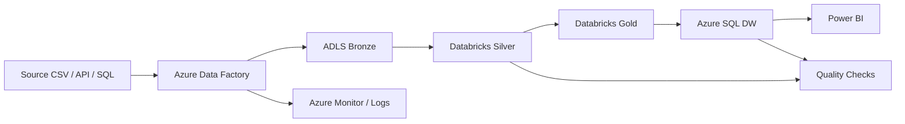

# Architecture

## Design principles
- Incremental ingestion
- Separation of storage and compute
- Medallion architecture
- Reusable orchestration
- Production readiness through monitoring and quality controls